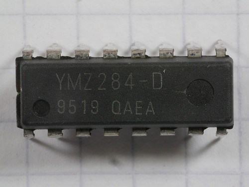

# playYMZtune #

The Yamaha YMZ284 is a 16-pin chip which has the same function and register-level interface as the General Instruments
[AY-3-8910](https://en.wikipedia.org/wiki/General_Instrument_AY-3-8910 "Wikipedia: General Instrument AY-3-8910").
The YMZ284, though, is smaller and has a simpler bus interface.
Unlike the AY-3-8910, it is write-only; register contents may not be read back.

This Arduino sketch uses a YMZ284 chip to play a short tune.

The ATmega328 on the Arduino is set up to generate a 2MHz clock on Arduino Pin 3
(ATmega328 Pin 5).
This is the 16MHz Arduino clock frequency divided by 8.

## Connections ##

| Signal | Arduino Pin | ATmega328 Pin | YMZ284 Pin | Notes                        |
|:-------|:------------|:--------------|:-----------|:-----------------------------|
| RxD    | 0           | PORTD0 pin 2  |            | Unused                       |
| TxD    | 1           | PORTD1 pin 3  |            | Unused                       |
| CS     | 2           | PORTD2 pin 4  | /CS pin 2  | Chip Select, active LOW      |
| CLK    | 3           | PORTD3 pin 5  | ΦM pin 7   | Main clock, 2MHz             |
| WR     | 4           | PORTD4 pin 6  | /WR pin 1  | Write Enable, active LOW     |
| A0     | 5           | PORTD5 pin 11 | A0 pin 3   | Address/Data Select          |
| D0     | 6           | PORTD6 pin 12 | D0 pin 16  | CPU interface data bus (LSB) |
| D1     | 7           | PORTD7 pin 13 | D1 pin 15  | CPU interface data bus       |
| D2     | 8           | PORTB0 pin 14 | D2 pin 14  | CPU interface data bus       |
| D3     | 9           | PORTB1 pin 15 | D3 pin 13  | CPU interface data bus       |
| D4     | 10          | PORTB2 pin 16 | D4 pin 12  | CPU interface data bus       |
| D5     | 11          | PORTB3 pin 17 | D5 pin 11  | CPU interface data bus       |
| D6     | 12          | PORTB4 pin 18 | D6 pin 10  | CPU interface data bus       |
| D7     | 13          | PORTB5 pin 19 | D7 pin 9   | CPU interface data bus (MSB) |
|        |             |               | /IC pin 8  | Initial Clear, active LOW    |
|        |             |               | SO pin 5   | D/A Converter Output (sound) |
| Vdd    | 5V          | VCC pin 7/21  | VDD pin 4  | +5V Power Supply             |
| Gnd    | Gnd         | GND pin 8/22  | GND pin 6  | Ground                       |

## YMZ284 Chip ##

